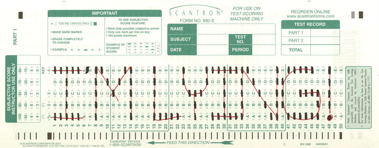
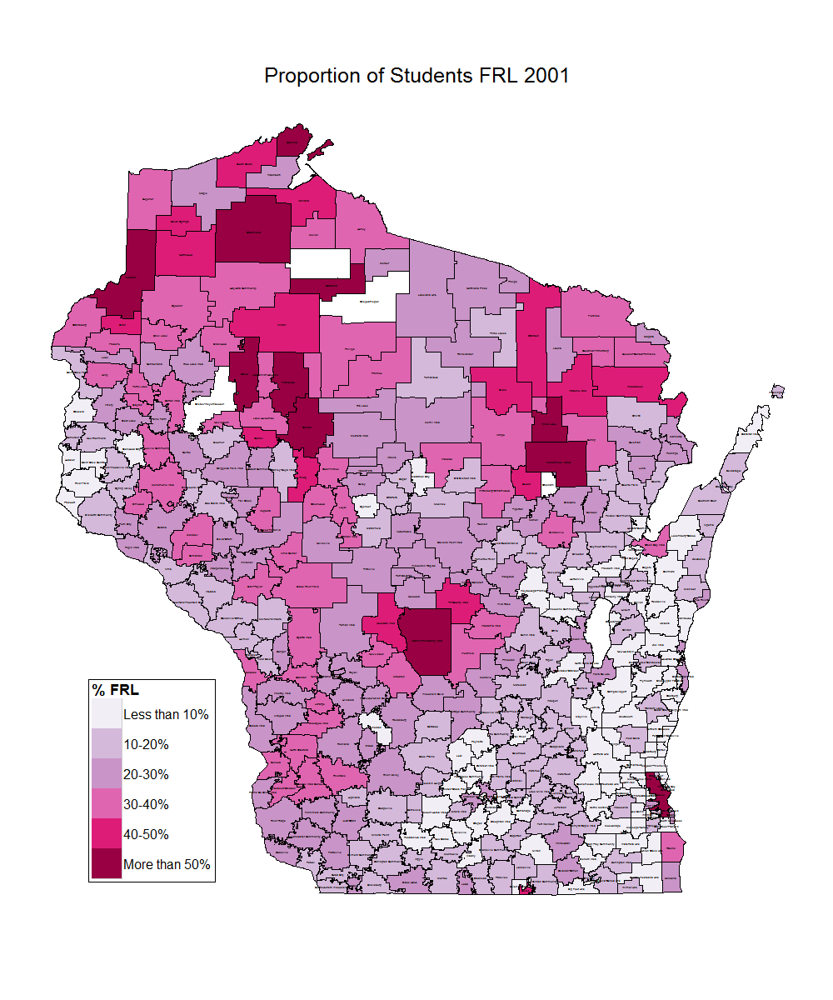
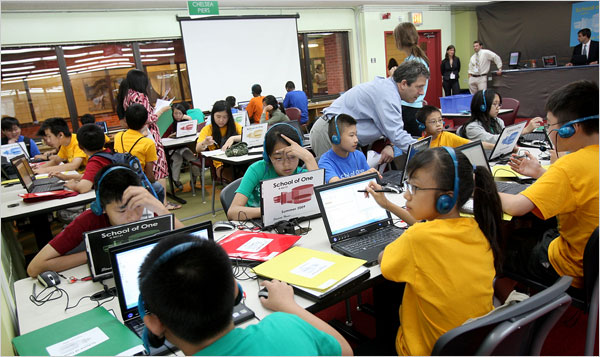

% Using R for Policy Research in a State Education Agency
% Jared Knowles, Wisconsin Department of Public Instruction
% June 13th, 2012

# What is a State Education Agency (SEA)?
- The administrative agency for public education in charge of disbursing funds, monitoring programs, and collecting data on the state of public schools
- Manages and coordinates financial outlays and state and federal programs for schools
- Collects records on all students on a number of dimensions
- Big entity, Wisconsin, for example, is a medium sized SEA:

 Annual Expenditures               Description
---------------------         -----------------------------------------------------
  $5.7 billion                   State and Federal school aids (money to schools)
  $101 million                   Program administration (state and federal)
  $80.7 million                  Aids to libraries, individuals, and organizations

# Did you say data?

Attribute                   Description
------------------  ---------------------------------------------------
Demographics          Gender, race, economic status, English proficiency 
Special Indicators    Homeless status, migrant status, etc.
Location              School, district, transfers between them
Discipline            Suspensions, expulsions, office referrals 
**Test scores**       NCLB tests for school accountability

  

# What questions does this pose?
- States and school districts have an abundance of data, but what does it mean?
- Can we do data analysis fast (and accurate) enough to inform decisions that improve student learning and well-being?
- Can we produce analyses that are approachable to policy makers and the public, that galvanize change?
- Can these analyses provide results accurate enough to inform decisions timely enough to be used in making decisions?
- Can we do these things in a time of reduced staffing, decreased budgets, and time constraints?

# Operational and Informational Systems 

Operational                    Informational
--------------------------     ---------------------------------------------------
School performance reports     Analysis of bilingual program effectiveness 
High school completion         Cluster analysis of math and reading scores
Student transfer reports            School, district, transfers between them
Discipline                     Suspensions, expulsions, office referrals 
**Test scores**                NCLB tests for school accountability

# The Vision
- States and districts have hundreds of attributes (very similar, but not identical) about millions of students in public K-12
- Data is collected often from before school age well past high school graduation
- Patterns can help inform policy choices 
- Simulations can be built to understand the effects of decisions before the decisions are made

# Education is Getting Harder

  

# Schools as Labs
- Schools run scores of experiments a day
  - Does this lesson help students better than this lesson?
  - Can we increase participation in this program with this incentive?
  - Does this punishment deter this behavior?
  - Does this policy increase attendance?
  - What learning tools increase student engagement?
- We are capturing more and more of these experiments in state data systems each year
- Results were previously evaluated using intuition and observation
- Better measurements, more subjects, and this means we can answer questions better

# Education generates more data every day

  

Hiroko Masuike for The New York Times

# The Joys of Government Work
- Financial and time constraints
- Transparency is critical, your work will be reviewed and scrutinized
- Political and administrative timelines are incredibly short or long cycle

# Questions
- Thank you!
- Learn more: [www.jaredknowles.com](http://www.jaredknowles.com/professional-work/)
- Get involved: [@jknowles](https://twitter.com/#!/jknowles)
- Ask Questions: [jared.knowles@dpi.wi.gov](mailto:jared.knowles@dpi.wi.gov)

  

