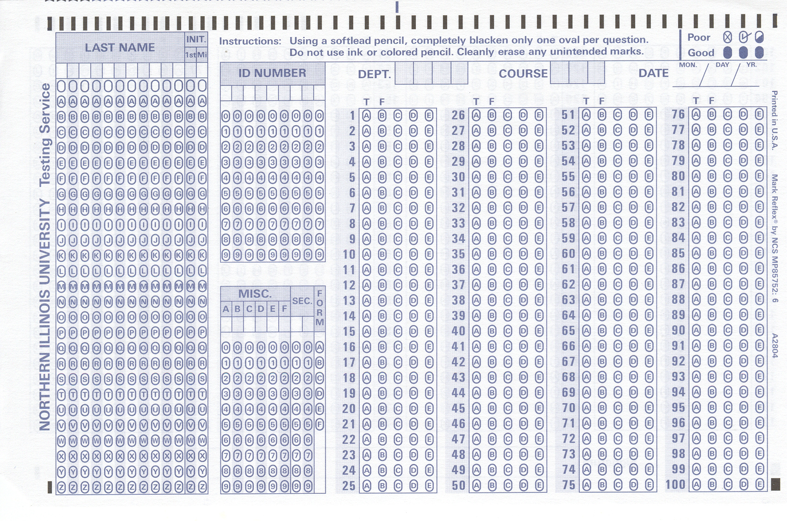

% Using R for Policy Research in a State Education Agency
% Jared Knowles
% June 13th, 2012

# What is a State Education Agency?
- The administrative agency for public education
- Manages and coordinates financial outlays and state and federal programs for schools
- Collects records on all students on a number of dimensions

  

Dollars Annually  |  Description
----------------  | --------------
$5.7 billion      | State and Federal school aids
$101 million      | Program administration (state and federal)
$80.7 million     | Aids to libraries, individuals, and organizations

# What types of data are collected?

Attribute  |  Description
---------- | -------------
Demographics | Gender, race, economic status, English proficiency, 
Special Indicators | Homeless status, migrant status, etc.
**Test scores**    | NCLB tests for school accountability

# What questions does this pose?

  

# What's the problem?
